# AWS Serverless Sales Analysis Reporting System

Sistem ini mengotomatiskan ekstraksi, pemrosesan, dan pengiriman laporan analisis penjualan harian dari database MySQL (EC2) di lingkungan VPC menggunakan arsitektur serverless di AWS. Pemrosesan data diatur secara terintegrasi menggunakan AWS Lambda, EventBridge, Systems Manager Parameter Store, dan Amazon SNS.

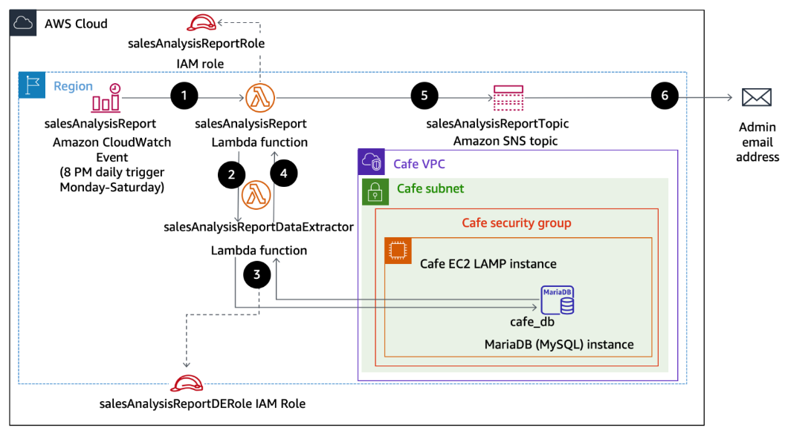

---

## Alur Arsitektur

1. **EventBridge (CloudWatch Events)** memicu fungsi Lambda `salesAnalysisReport` sesuai jadwal cron.
2. **`salesAnalysisReport`** mengambil kredensial koneksi database secara aman dari **AWS Systems Manager Parameter Store**.
3. Fungsi pelapor memanggil **`salesAnalysisReportDataExtractor`** untuk mengeksekusi query data transaksi pada **Database MySQL (EC2)** di dalam VPC.
4. **`salesAnalysisReportDataExtractor`** menggunakan **PyMySQL Lambda Layer** untuk membaca data dari database.
5. **`salesAnalysisReport`** mengolah data transaksi menjadi format laporan ringkas dan mempublikasikannya ke **Amazon SNS Topic**.
6. **Amazon SNS** mengalirkan notifikasi email berisi laporan harian ke administrator.

---

## Layanan AWS yang Digunakan

* **AWS Lambda**: Mengakses database, mengolah data, dan mengirim notifikasi tanpa mengelola server.
* **AWS Systems Manager Parameter Store**: Menyimpan kredensial database secara terpusat dan aman.
* **Amazon VPC**: Mengamankan komunikasi jaringan antara Lambda Extractor dan instance MySQL DB.
* **Amazon SNS**: Mengirimkan email laporan penjualan ke penerima terdaftar.
* **Amazon EventBridge**: Menjalankan pemicu otomatisasi berdasar jadwal (cron).

---

## Detail Implementasi dan Penjelasan Tugas

### Task 1: Analisis dan Verifikasi Hak Akses IAM
Langkah awal dilakukan dengan memeriksa kebijakan keamanan (IAM Policy) pada dua role utama: `salesAnalysisReportRole` (akses ke SNS, SSM Parameter Store, dan CloudWatch) serta `salesAnalysisReportDERole` (akses dasar Lambda dan VPC Execution). Memastikan fungsi Lambda berjalan sesuai prinsip least privilege.

* **Task 1.1: Permisi IAM Role `salesAnalysisReportRole`**
  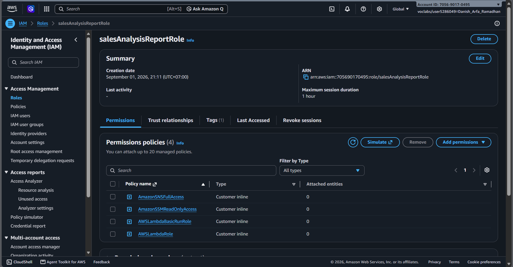
* **Task 1.2: Permisi IAM Role `salesAnalysisReportDERole`**
  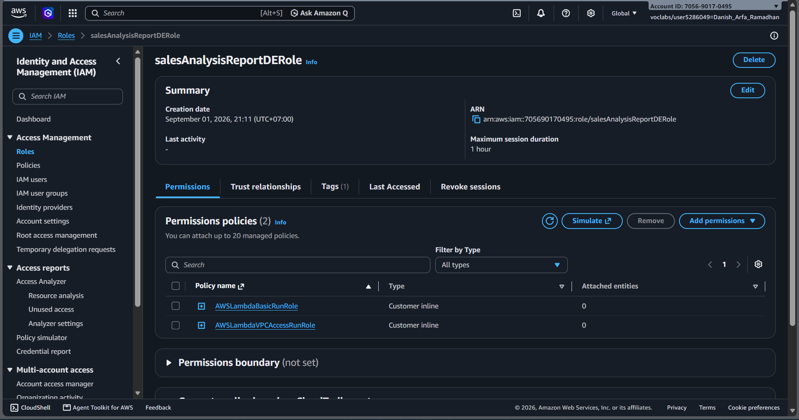

---

### Task 2: Pembuatan Lambda Layer dan Deploy Extractor Function
Membuat kustom Lambda Layer berisi pustaka `pymysql` agar fungsi dapat berkomunikasi dengan database MySQL. Selanjutnya, mendefinisikan fungsi `salesAnalysisReportDataExtractor`, mengaitkan layer, mengunggah kode sumber, serta mengonfigurasi VPC (Subnet dan Security Group) agar fungsi berada di dalam jaringan yang sama dengan database.

* **Task 2.1: Konfigurasi Lambda Layer `pymysqlLibrary`**
  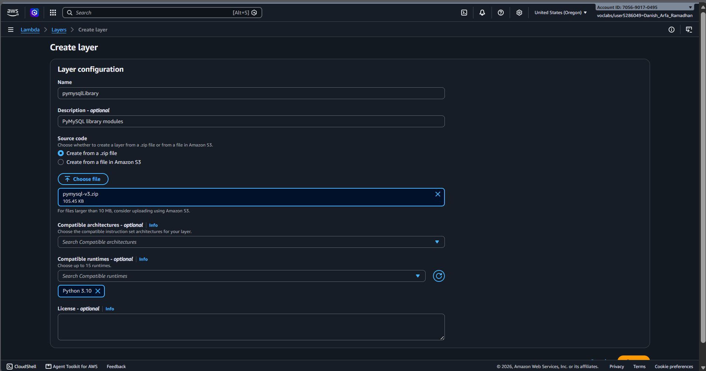
* **Task 2.2: Inisialisasi fungsi `salesAnalysisReportDataExtractor`**
  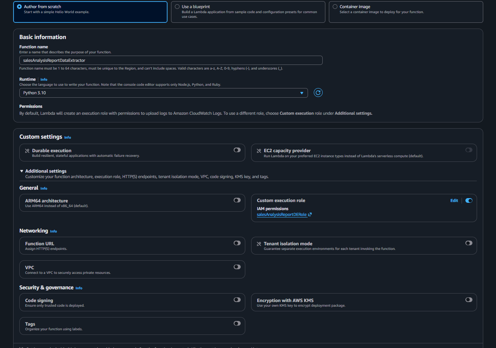
* **Task 2.3: Pemasangan PyMySQL Layer pada fungsi Lambda**
  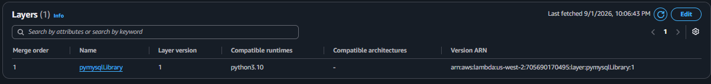
* **Task 2.4: Pengaturan handler `salesAnalysisReportDataExtractor.lambda_handler` dan upload kode**
  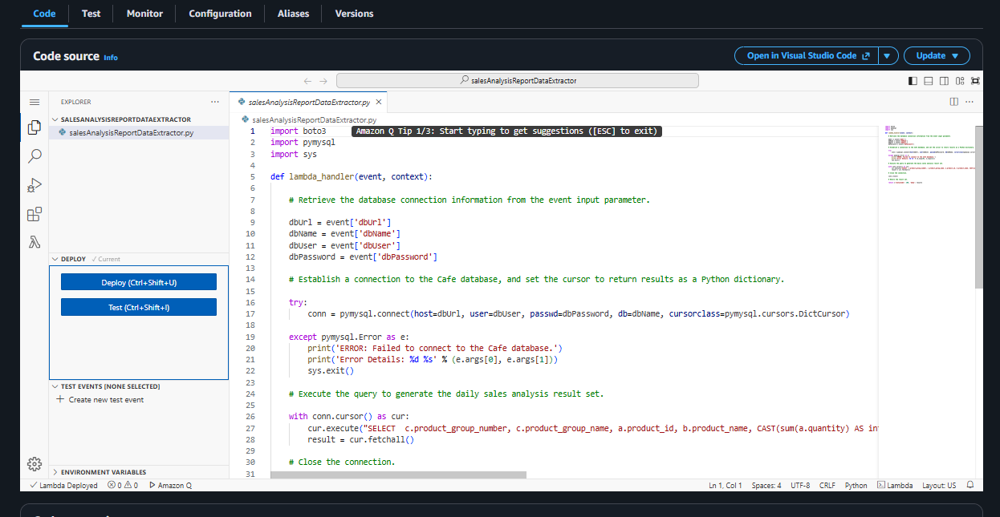
* **Task 2.5: Integrasi VPC (Cafe VPC, Subnet, dan Security Group)**
  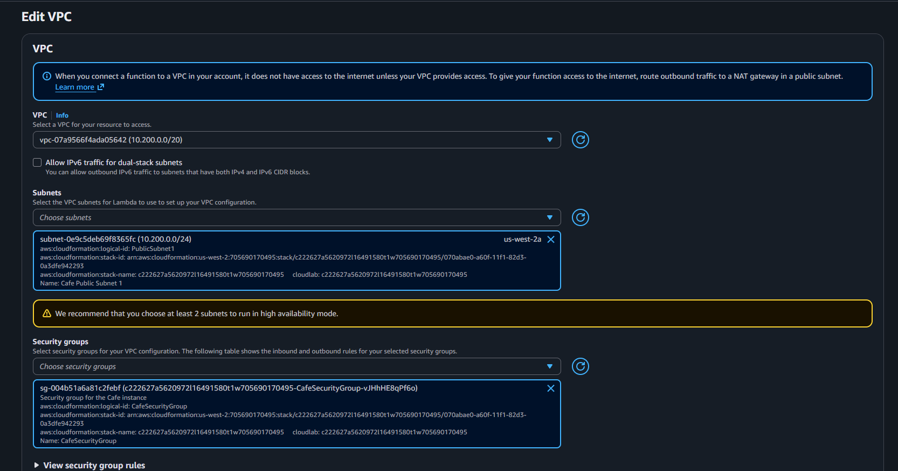

---

### Task 3: Pengujian Koneksi Database dan Troubleshooting
Melakukan uji coba eksekusi fungsi ekstraktor. Pada percobaan pertama, koneksi gagal (timeout 3.00 detik) karena Security Group EC2 database melarang trafik masuk pada port database.

**Analisis & Perbaikan:**
Aturan Inbound Rules pada `CafeSecurityGroup` diperbarui dengan membuka port **MySQL/Aurora (3306)**. Setelah perbaikan, fungsi berhasil terhubung. Pengujian dilanjutkan dengan membuat transaksi simulasi pada aplikasi web Café untuk memastikan data pesanan berhasil diekstrak dalam bentuk array JSON.

* **Task 3.1 & 3.2: Error timeout saat pengujian awal**
  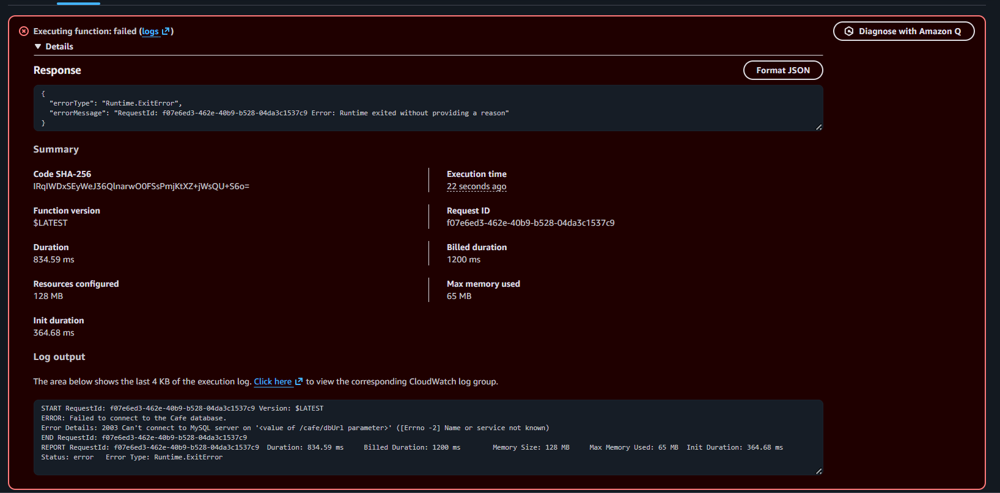
* **Task 3.3: Konfigurasi Inbound Rule Port 3306 dan tes koneksi berhasil**
  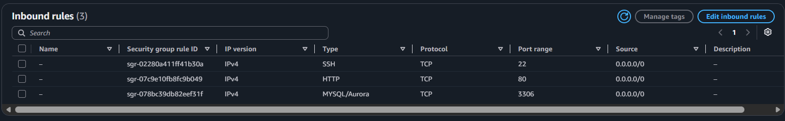
  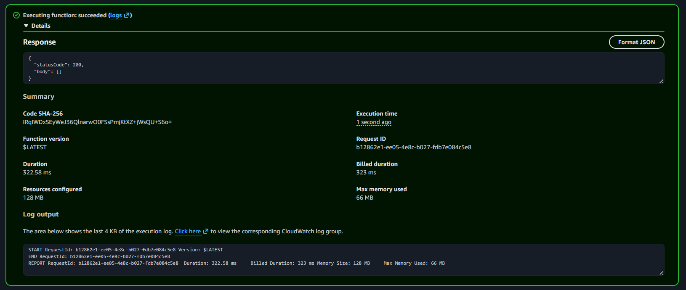
* **Task 3.4: Transaksi pada web Café dan verifikasi output JSON data pesanan**
  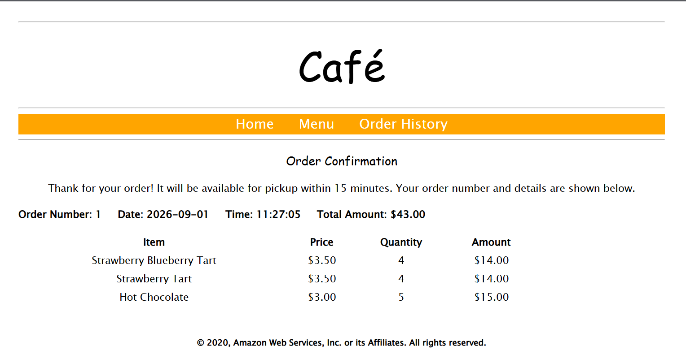
  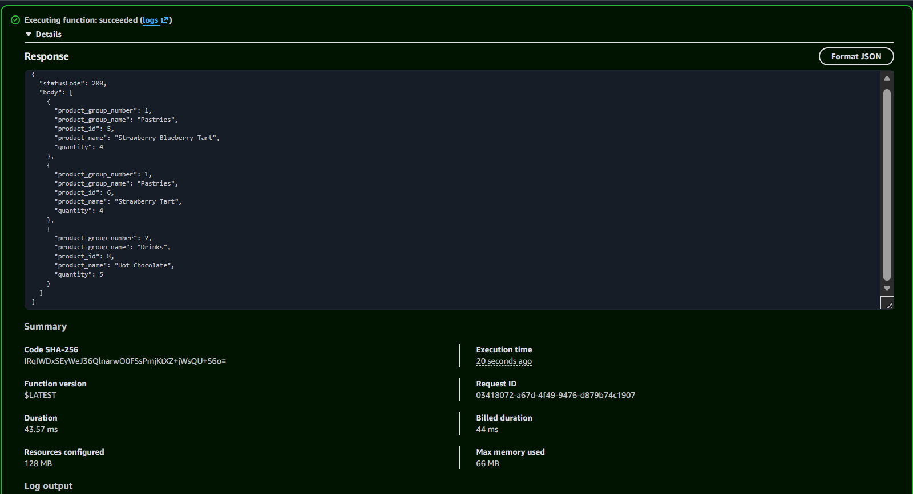

---

### Task 4: Konfigurasi Sistem Notifikasi Amazon SNS
Membuat SNS Topic `salesAnalysisReportTopic` sebagai media publikasi pesan laporan. Menambahkan langganan (subscription) berupa email administrator dan melakukan konfirmasi tautan yang dikirimkan AWS ke inbox email agar status langganan berubah menjadi Confirmed.

* **Task 4.1: Pembuatan SNS Topic `salesAnalysisReportTopic`**
  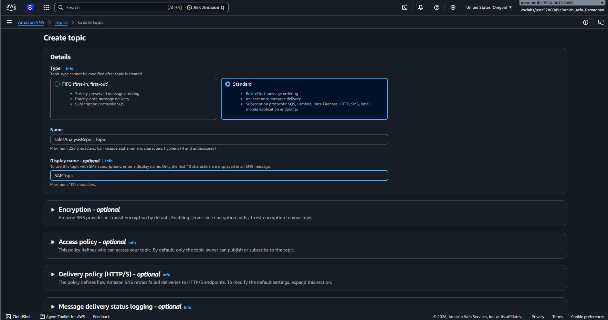
* **Task 4.2: Status konfirmasi langganan email penerima**
  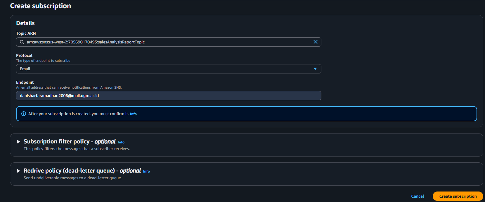

---

### Task 5: Orchestration Fungsi Utama dan Otomatisasi EventBridge
Menggunakan AWS CLI di instance host untuk mendefinisikan dan mentransfer fungsi pemroses laporan utama (`salesAnalysisReport`). Mengatur variabel lingkungan `topicARN` agar Lambda dapat mengirim pesan ke SNS Topic yang tepat. Menguji fungsi secara manual untuk memverifikasi laporan masuk ke email, lalu mengonfigurasi pemicu EventBridge berbasis ekspresi cron untuk pengiriman laporan otomatis secara berkala.

* **Task 5.2: Autentikasi AWS CLI (`aws configure`)**
  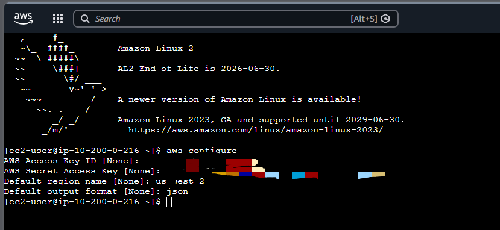
* **Task 5.3: Deployment fungsi `salesAnalysisReport` via CLI**
  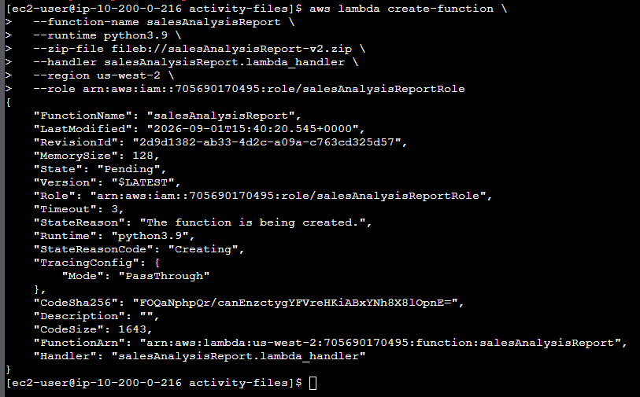
* **Task 5.4: Pengaturan Environment Variable `topicARN`**
  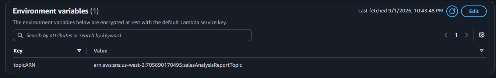
* **Task 5.5: Pengujian manual dan penerimaan email laporan pertama**
  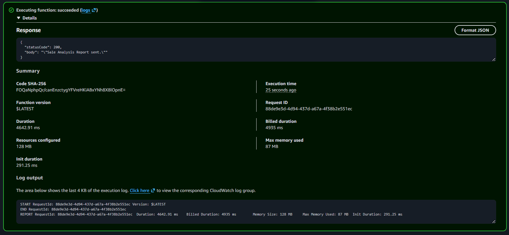
  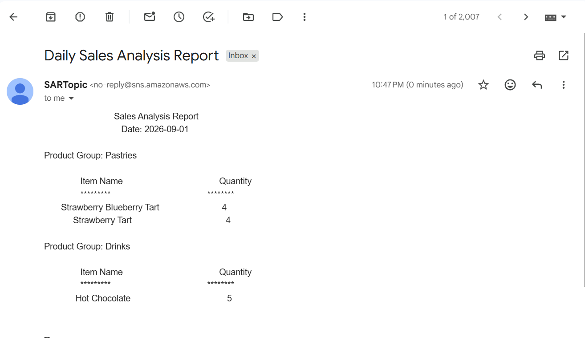
* **Task 5.6: Konfigurasi pemicu EventBridge Cron dan penerimaan email otomatis**
  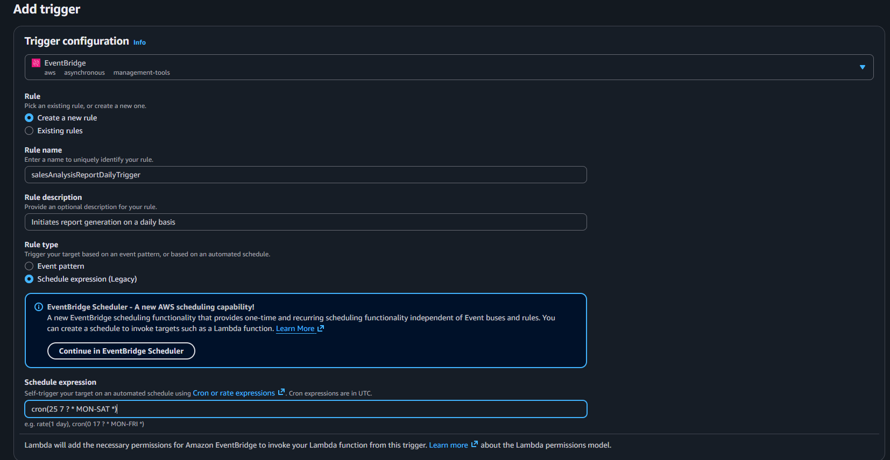
  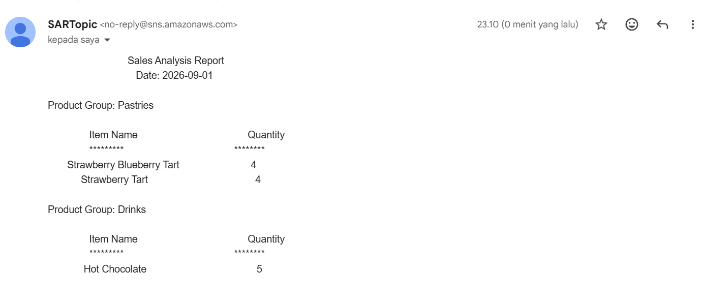
